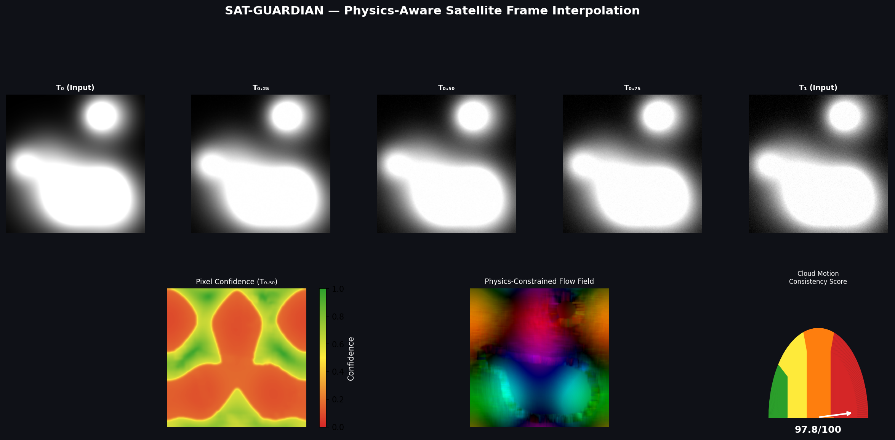

<div align="center">

# 🛰️ SAT-GUARDIAN

### Physics-Aware Adaptive Satellite Frame Interpolation System

**Turn 30-minute INSAT-3DS observations into adaptive 7.5-minute weather intelligence — using physics-constrained AI.**


</div>

---

## 🌍 The Problem

India's **INSAT-3DS** geostationary satellite captures atmospheric imagery every **30 minutes**. For fast-evolving phenomena, that gap is a critical blind spot:

- ⛈️ **Rapid cyclone intensification** — can change dramatically in under 30 minutes
- 🌪️ **Severe convective storm** tracking
- 🔥 **Forest-fire** spread prediction
- 🌊 **Flood** early-warning systems

**SAT-GUARDIAN** synthesises intermediate frames at **T+7.5, T+15, and T+22.5 min**, delivering **4× temporal super-resolution** of satellite observations — while staying physically consistent with atmospheric wind fields.

---

## ✨ Highlights

- 🌬️ **Physics-constrained optical flow** — blends Farneback dense flow with **ERA5 wind fields** (70/30)
- 🎞️ **Cascaded three-frame generation** — T0.25, T0.50, T0.75 via bilateral warping + a compact **LightUNet**
- 🗺️ **Pixel-wise confidence maps** — per-pixel reliability from flow discrepancy & occlusion detection
- 📐 **Cloud Motion Consistency Score (CMCS)** — a 0–100 physics-alignment metric
- 🛰️ **NetCDF (.nc) support** — ingest real INSAT-3DS frames and ERA5 wind data
- 📊 **Rich visualizations** — dashboards, quiver/HSV flow maps, heatmaps, and animated GIFs
- 🔁 **End-to-end pipeline** — one command from raw frames to finished intelligence

---

## 📈 Results (synthetic benchmark)

| Metric | T0.25 | T0.50 | T0.75 |
|--------|:-----:|:-----:|:-----:|
| **SSIM** ↑ | 0.997 | 0.993 | 0.992 |
| **PSNR (dB)** ↑ | 47.9 | 45.9 | 45.2 |
| **FSIM** ↑ | 0.981 | 0.982 | 0.982 |

> **Cloud Motion Consistency Score: `97.75 / 100`** — *Excellent: motion highly consistent with ERA5 wind.*
> **Temporal consistency: `0.9999`**

<div align="center">



*Full pipeline dashboard — generated frames, confidence map, flow field, and metrics.*

</div>

---

## 🏛️ Architecture

```
┌─────────────────────────────────────────────────────────────────┐
│                       SAT-GUARDIAN Pipeline                       │
│                                                                   │
│  ┌──────────┐   ┌──────────┐   ┌──────────┐                       │
│  │ Frame T0 │   │ ERA5     │   │ Frame T1 │                       │
│  │ (Input)  │   │ Wind u,v │   │ (Input)  │                       │
│  └────┬─────┘   └────┬─────┘   └────┬─────┘                       │
│       └──────────────┼──────────────┘                             │
│               ┌───────▼────────┐                                  │
│               │ Physics-Aware  │  0.7 × Farneback                 │
│               │ Optical Flow   │  0.3 × ERA5 wind                 │
│               └───────┬────────┘                                  │
│               ┌───────▼────────┐                                  │
│               │  LightUNet     │  (encoder-decoder)               │
│               └───────┬────────┘                                  │
│           ┌───────────┼───────────┐                               │
│           ▼           ▼           ▼                               │
│        T0.25       T0.50       T0.75                              │
│      (+7.5min)   (+15min)    (+22.5min)                           │
│           └───────────┼───────────┘                               │
│           ▼           ▼           ▼                               │
│      Confidence   Cloud Motion   Image Quality                    │
│         Map      Score (CMCS)    (SSIM/PSNR/FSIM)                  │
└─────────────────────────────────────────────────────────────────┘
```

| Component | Description | Algorithm |
|-----------|-------------|-----------|
| **Optical Flow** | Dense motion estimation | Farneback + ERA5 blend (70/30) |
| **Frame Generator** | Cascaded interpolation | Bilateral warping + LightUNet |
| **LightUNet** | Neural interpolator | 4-level U-Net encoder-decoder |
| **Confidence Map** | Per-pixel reliability | Flow discrepancy + FB-consistency |
| **CMCS** | Physics alignment score | Cosine similarity (flow vs wind) |

---

## ⚡ Quick Start

```bash
# 1. Clone
git clone https://github.com/<your-org>/sat-guardian.git
cd sat-guardian/sat-guardian

# 2. Environment
python -m venv venv
source venv/bin/activate          # Windows: venv\Scripts\activate

# 3. Dependencies
pip install -r requirements.txt

# 4. Run the full pipeline on synthetic sample data
python scripts/demo.py
```

The demo generates synthetic INSAT-like frames + ERA5 wind, computes physics-constrained flow, produces **T0.25 / T0.50 / T0.75**, and saves frames, a GIF, confidence maps, and a dashboard to `outputs/`.

```bash
python scripts/evaluate.py                        # Evaluate vs. baseline
python scripts/train.py --epochs 20 --batch-size 4  # (Optional) train LightUNet
pytest tests/ -v                                  # Run the test suite
```

---

## 💻 Using Real Data

```python
from src.data_loader import load_insat_frame, load_era5_wind
from src.inference import SATGuardianInference

# Load INSAT-3DS frames + ERA5 wind from NetCDF
frame_t0 = load_insat_frame("data/raw/insat3ds_T0.nc", variable="brightness_temperature")
frame_t1 = load_insat_frame("data/raw/insat3ds_T1.nc", variable="brightness_temperature")
wind_u, wind_v = load_era5_wind("data/processed/era5_wind.nc",
                                u_variable="u", v_variable="v", target_shape=(256, 256))

# Run inference
engine  = SATGuardianInference("configs/config.yaml")
results = engine.run(frame_t0, frame_t1, wind_u, wind_v)
engine.save_all(results, output_dir="outputs/")

frame_050 = results["frame_050"]                  # T+15 min
cmcs      = results["cloud_motion"]["overall_score"]
```

---

## 🔬 How It Works

**1 · Physics-constrained flow** — `final_flow = 0.70 × Farneback + 0.30 × ERA5_wind_px`, where wind (m/s) is converted to pixel displacement via `wind × Δt / pixel_size`.

**2 · Cascaded generation** — bilateral warping blends forward/backward warps:
`T0.50` first, then `T0.25` and `T0.75` from the midpoint.

**3 · LightUNet** — a ~2M-parameter 4-level U-Net (inputs: T0, T1, flow magnitude) trained with an L1 + SSIM loss and cosine-annealed LR.

**4 · Confidence** — `confidence = exp(-‖flow − wind_flow‖ / scale)`, optionally penalised by forward-backward inconsistency.

**5 · CMCS** — `mean(cosine_similarity(flow, wind)) × 100`.

| Score | Interpretation |
|:-----:|----------------|
| 80–100 | Excellent — highly physics-consistent |
| 60–80  | Good — moderate consistency |
| 40–60  | Fair — some disagreement |
| 0–40   | Poor — inconsistent with ERA5 wind |

---

## 📁 Repository Layout

```
BAH/
└── sat-guardian/
    ├── configs/config.yaml          ← Master configuration
    ├── data/{raw,processed,sample}/ ← INSAT frames, ERA5 wind, synthetic data
    ├── notebooks/                   ← Exploration & interactive demo
    ├── src/                         ← Core library (flow, model, metrics, inference…)
    ├── scripts/                     ← demo.py · train.py · evaluate.py
    ├── outputs/                     ← Generated frames, confidence maps, GIFs
    ├── tests/test_all.py            ← Unit test suite
    └── requirements.txt
```

> 📖 See [`sat-guardian/README.md`](sat-guardian/README.md) for the full technical deep-dive, module reference, and ERA5 download instructions.

---

## 🗺️ Downloading ERA5 Wind Data

```bash
pip install cdsapi   # then add your CDS credentials to ~/.cdsapirc
python - <<'EOF'
import cdsapi
cdsapi.Client().retrieve('reanalysis-era5-pressure-levels', {
    'product_type': 'reanalysis',
    'variable': ['u_component_of_wind', 'v_component_of_wind'],
    'pressure_level': ['500'],
    'year': '2024', 'month': '06', 'day': '15',
    'time': '00:00', 'format': 'netcdf',
}, 'era5_wind.nc')
EOF
```

---

## 🚀 Roadmap

- 🔥 Train on real INSAT-3DS data paired with NWP model output
- 🔥 Learned flow networks (RAFT / FlowNet2) & multi-channel (IR, WV, VIS) support
- 📈 Diffusion-based frame synthesis & MC-Dropout uncertainty
- 🔬 Physics-informed (PINN) loss and microwave-sounder assimilation

---

## 📚 References

1. Farneback, G. (2003). *Two-Frame Motion Estimation Based on Polynomial Expansion.* SCIA.
2. Ronneberger, O. et al. (2015). *U-Net: Convolutional Networks for Biomedical Image Segmentation.* MICCAI.
3. Niklaus, S. et al. (2018). *Video Frame Interpolation via Adaptive Separable Convolution.* ICCV.
4. Hersbach, H. et al. (2020). *The ERA5 Global Reanalysis.* QJRMS.
5. ISRO. *INSAT-3DS Satellite Documentation.* SAC/ISRO.

---


<div align="center">

**Built for the BAH Hackathon 🏆 · Satellite AI Track**

*Bridging temporal gaps in Earth observation with physics-aware AI.*

</div>
